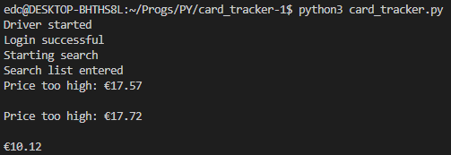

# Card Tracker

A simple script to search [cardtrader](https://www.cardtrader.com) for a specific card or group of cards at the best price according to the specified filters.

## Setup and Deployment

For security reasons I have decided to pass sensible data throughtout enviornment variables. 

Before executing the script it's necessary to set up said enviornment variables, you'll need a [cardtrader account](https://www.cardtrader.com/users/sign_up) and it's password and email. While you can use [this short guide](https://www.browserstack.com/guide/geckodriver-selenium-python) to set up gecko driver.

Having obtained your credentials you can set up the envoirnment variables with the following commands in your terminal. 

```bash
export CT_PSW   = <your card trader password>

export CT_USR   = <your card trader email>
```

> Note that you may need an older version of firefox to be able to run this script, you can check for compatibility on the [Mozilla docs](https://firefox-source-docs.mozilla.org/testing/geckodriver/Support.html).  

(you can use `env` to check if they have been set up correctly)

```bash
python3 card_tracker.py
```
should start the script and you should be able to see the results in the terminal.


## Roadmap(?)
The idea was to implement the group search feature using Dijkstra's algorithm to find the best path between the cards, accounting both for single card price and shipping costs. However, as there is already a feature in the website that allows you to search for multiple cards at once, I decided to leave it as is. (Hopefully the real developers are better than me and the current feature is better than what I could have implemented.)

You may find some functions that are not being used, CM stands for cardmarket but since they use cloudflare I am unable to scrape their website, proxy servers are not an option as they are not free and I am not willing to pay for this project. Still the code is there in case you want to use it for your own project.
